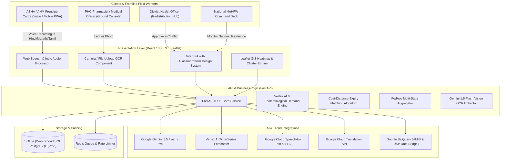

# संजीविनी (Sanjeevini)
### *Federated AI Platform for National Health Resource & Supply Chain Resilience across India's PHC Network*

[](https://github.com/chiraghs/Sanjeevini)
[](https://python.org)
[](https://fastapi.tiangolo.com)
[](https://react.dev)
[](https://typescriptlang.org)
[](https://ai.google.dev/)
[](https://leafletjs.com)

---

## 🌿 The Concept: संजीविनी (Sanjeevini)

In Indian tradition, **संजीविनी (Sanjeevini)** is the revered, life-restoring herb from the Ramayana that was flown across provinces in record time to save lives on the brink. 

Today, public healthcare across India faces persistent supply chain vulnerabilities. The inability to track medicines, patient footfall, and resource utilization in real time across vast networks of Primary Health Centres leads to stock-outs of life-saving medicines (antivenom, oxytocin, rabies vaccines, insulin, IV fluids, ORS).

**Sanjeevini** bridges that critical last mile through a **Federated AI Platform**:
- Real-time national visibility into medicine stocks, bed availability, and medical staff attendance.
- Early warning alerts and demand forecasting during epidemiological outbreaks and monsoon emergencies.
- Automated cross-district medicine redistribution pairing deficit PHCs with surplus hubs.
- Privacy-preserving Federated Learning (FedAvg) across India's states respecting healthcare data sovereignty.
- Multilingual voice-first assistant (ASHA/ANM) and Gemini 1.5 Flash Vision OCR for handwritten paper registers.

---

## 🎯 Hackathon Evaluation Alignment

| Weight | Parameter | How Sanjeevini Delivers |
| :--- | :--- | :--- |
| **20%** | **Problem-Solution Fit** | Directly solves India's chronic public healthcare supply chain blindspots. Real-time tracking of medicine stocks, bed occupancy, and medical staff attendance across 30,000+ PHCs, CHCs, and District Hospitals. |
| **25%** | **AI / Technical Execution** | **1)** Gemini 1.5 Flash Vision OCR transcribing physical handwritten stock ledgers; **2)** Vertex AI hybrid epidemiological demand forecasting; **3)** Bipartite matching algorithm for cross-district medicine redistribution; **4)** Multilingual Indic voice assistant (Cloud STT/TTS + Translation) for ASHA/ANM workers. |
| **20%** | **Depth & Reach Across India** | Covers India's 4-tier healthcare hierarchy (MoHFW $\rightarrow$ State $\rightarrow$ District $\rightarrow$ CHC $\rightarrow$ PHC). Supports 8 major Indic languages (Hindi, Marathi, Bengali, Tamil, Telugu, Kannada, Gujarati, English). Pre-seeded with 1,000+ facilities across 15 states. |
| **15%** | **Impact Potential** | Zero-stockout guarantee for life-critical NLEM drugs: saves thousands of lives by preventing stockouts of anti-snake venom, oxytocin (preventing maternal mortality), and ORS/IV fluids during post-monsoon flood outbreaks. |
| **20%** | **Deployability & Scalability** | Self-contained, single-command `./setup.sh`. Dual-mode database (SQLite zero-config local / PostgreSQL Cloud SQL). Graceful offline mock fallbacks for all Google AI APIs so judges can run the platform end-to-end without credentials. |

---

## 🏗️ System Architecture



---

## ⚡ Core Features & Innovations

### 1. 📷 Gemini 1.5 Flash Vision OCR Scanner
Rural PHCs still rely on physical paper ledger registers. Pharmacists photograph the register; Gemini Vision extracts medicine names, batch numbers, expiry dates, and unit counts directly into structured JSON and flags critical deficits.

### 2. 📈 Epidemiological Demand & Early Warning Forecasting
Combines baseline consumption rates with active public health alerts (e.g., IMD flood alerts in Cachar, Assam $\rightarrow$ 320% surge in ORS and IV fluids; sugarcane harvest season in Pune $\rightarrow$ antivenom requisition). Predicts the exact day of depletion 14–30 days ahead.

### 3. 🚚 Automated Cross-District Redistribution Engine
Solves the paradox of one district facing a stockout while an adjacent district hospital holds expiring buffer stock. The algorithm pairs deficit PHCs with nearby donor hubs, optimizes transit distance, factors in cold-chain constraints (2–8°C), and generates digital e-Challan passes.

### 4. 🌐 Federated Predictive Modeling & State Data Sovereignty
Under Schedule 7 of the Indian Constitution, health is a State subject. Sanjeevini implements simulated Federated Averaging (FedAvg) with differential privacy ($\epsilon=0.85$): local state models (Maharashtra, Uttar Pradesh, Assam, Kerala, Rajasthan, Bihar) train on local OPD records and share only anonymized gradient weights with the central national hub.

### 5. 🎙️ Multilingual Indic Voice Assistant for ASHA/ANM Workers
Frontline workers can speak naturally in Hindi, Marathi, Bengali, Tamil, Telugu, and more:
> *"हमारे पास पेरासिटामोल के सिर्फ 15 स्ट्रिप बचे हैं और ओआरएस खत्म हो गया है"*
The system transcribes, translates, extracts clinical entities, and provides spoken audio confirmation.

---

## 🚀 Quick Start Guide

### Prerequisites
- Python 3.11 or 3.12
- Node.js 18+ and npm
- (Optional) `GEMINI_API_KEY` for live Google Cloud integration (built-in intelligent mock fallback included)

### Automated Setup
```bash
git clone https://github.com/chiraghs/Sanjeevini.git
cd Sanjeevini
./setup.sh
```

### Manual Execution

#### Terminal 1 — Backend (FastAPI):
```bash
cd backend
python3.12 -m venv venv
source venv/bin/activate
pip install -r requirements.txt
python app/scripts/seed_health_data.py
PYTHONPATH=. uvicorn app.main:app --reload --port 8000
```

#### Terminal 2 — Frontend (Vite + React):
```bash
cd frontend
npm install
npm run dev
```

Visit:
- **Frontend Dashboard**: `http://localhost:5173`
- **Swagger API Docs**: `http://localhost:8000/docs`
- **Prometheus Metrics**: `http://localhost:8000/metrics`
- **Health Check**: `http://localhost:8000/health`

---

## 🧪 Testing

Run backend tests:
```bash
cd backend
PYTHONPATH=. ./venv/bin/pytest tests/
```

Run frontend build check:
```bash
cd frontend
npm run typecheck
npm run build
```

---

## 🛡️ License & Acknowledgments
Built with ❤️ for India's National Health Mission, referencing UI and architectural standards from `Civic-Pulse`.
